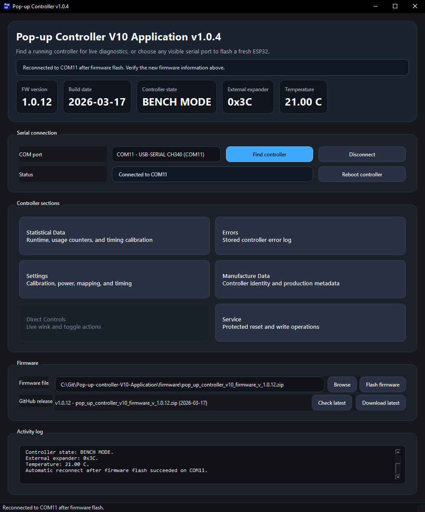

# Pop-up Controller V10 Application

Open-source PySide6 desktop application for communicating with and flashing an ESP32 on a Pop-up controller V10 over serial.
All revisions of the V10 will be supported.

Check releases for exe builds!  
https://github.com/sheep-celica/Pop-up-controller-V10-Application/releases



## License

This project is licensed under `GPL-2.0-or-later`.

See [LICENSE](LICENSE) for the full license text and [THIRD_PARTY_NOTICES.md](THIRD_PARTY_NOTICES.md) for bundled dependency notices.

## Features

- Detect and connect to the controller over serial
- Read controller build information, status, errors, manufacture data, and settings
- Send direct control commands and protected service commands
- Flash ESP32 firmware bundles from `pop_up_controller_v10_firmware_v_x.x.x.zip`
- Package a standalone Windows executable with PyInstaller and bundled `esptool`
- Stamp every git commit with an incremented application version via a repo hook (This is just for some basic versioning)

## Development setup

```powershell
py -3.14 -m venv .venv
.venv\Scripts\Activate.ps1
python -m pip install --upgrade pip
python -m pip install -e .[dev]
```

## Git hook setup

The repository ships a tracked pre-commit hook in `.githooks\pre-commit`.

Install it for your local clone with:

```powershell
scripts\install_git_hooks.ps1
```

Each commit bumps the patch version in `src\popup_controller\__init__.py` and `pyproject.toml`, starting from `1.0.0`.

## Flash bundle format

The flashing workflow expects either:

- a `pop_up_controller_v10_firmware_v_x.x.x.zip` that contains `flash_manifest.json` plus the referenced binary images, or
- an extracted bundle directory, or
- a standalone `flash_manifest.json` next to the referenced images.

The current firmware bundle in [firmware/pop_up_controller_v10_firmware_v_1.0.5.zip](firmware/pop_up_controller_v10_firmware_v_1.0.5.zip) is compatible with the built-in flashing workflow.

## Building the executable

Use the PowerShell helper script:

```powershell
Set-ExecutionPolicy -Scope Process -ExecutionPolicy RemoteSigned
scripts\build_exe.ps1
```

The script:

- optionally runs the test suite first
- runs PyInstaller with the checked-in spec file
- embeds the app icon and bundles the Python `esptool` package inside the executable
- writes a versioned executable such as `popup-controller-v1.0.0.exe`
- copies `LICENSE`, `README.md`, and `THIRD_PARTY_NOTICES.md` into `dist\`
- copies the local `firmware\` directory into `dist\firmware\`
- copies available third-party license texts into `dist\third_party_licenses\`

To skip tests during a local packaging iteration:

```powershell
scripts\build_exe.ps1 -SkipTests
```

## Distribution note

Binary distributions of this application should be shared together with the corresponding source code, or with a clear link to the public source repository, so the GPL obligations remain satisfied.

## Project layout

```text
.
|-- .githooks/
|-- docs/
|-- firmware/
|-- scripts/
|-- src/
|   `-- popup_controller/
|-- tests/
|-- LICENSE
|-- THIRD_PARTY_NOTICES.md
|-- popup-controller.spec
`-- pyproject.toml
```
